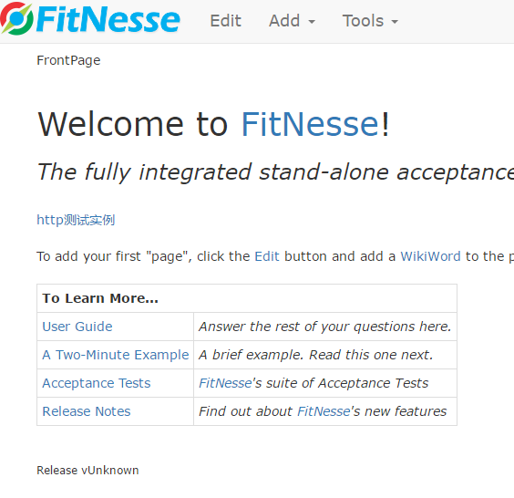
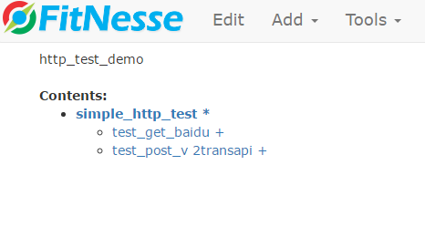
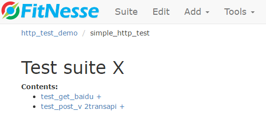
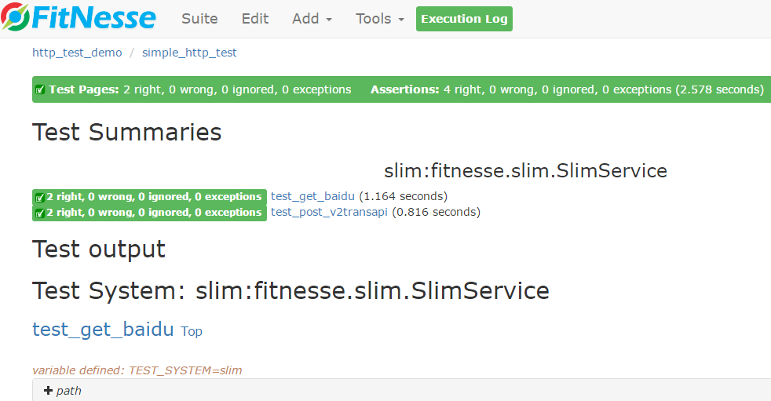

### fitnesse 接口测试实例
> 项目地址：https://github.com/unclebob/fitnesse

> 官网地址：http://fitnesse.org/

> 构建地址：https://cleancoder.ci.cloudbees.com/job/fitnesse/

> 仓库地址：http://repo1.maven.org/maven2/org/fitnesse/fitnesse/

> eclipse插件：http://fitnesse-eclipse.github.io/

> jenkins插件：https://wiki.jenkins-ci.org/display/JENKINS/Fitnesse+Plugin

FitNesse是一套软件测试工具　从另外一个角度看，FitNesse是一个轻量级的、开源的框架，能够帮助开发团队方便的定义验收测试（Acceptance Tests），通过在web页面上简单的输出和预计输出的表格就可实现，并且可以运行这些测试以确定是否通过。FitNesse 是 wiki可以很方便的创建和编辑页面　FitNesse是一个web服务器不用过多的安装配置，很方便使用。

**1. 目录结构说明**

****1.fitnesse-demo****

fitnesse 内置feature测试java代码

****2.fitnesse-feature****

开发一些测试组件，如httpclient，dbutil等。
httpclient：基于okhttp开发的fitnesse的feature，用于http api测试。

****3.selenium-demo****

selenium的一些测试java代码以及集成fitnesse实例代码

****4.FitNesseRoot****

fitnesse 工作目录，存放wiki编写的文件以及以来的jar

****5.xebium****

xebium项目源码：https://github.com/xebia/Xebium

****6.images等资源****

文档展示图片等资源
**3. fitnesse服务启动**

window 运行startFitnesse.bat即可，linux运行startFitnesse脚本，运行fitnesse-standalone.jar，工作目录FitNesseRoot

**4. 实例样图**

